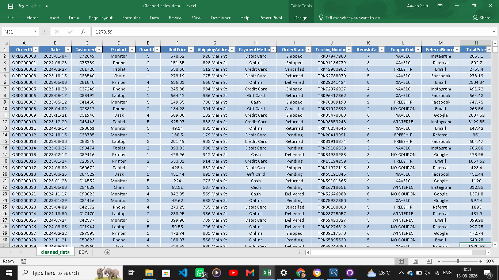

# Data Analyst Project 1 – Data Cleaning

## 📌 Project Overview

This project focuses on cleaning and preparing a raw sales dataset using Microsoft Excel. The objective was to improve data quality, consistency, and reliability so that the dataset could be used for further analysis.

## 🎯 Objectives

- Identify and handle missing values
- Check and remove duplicate records
- Standardize date formats
- Improve text formatting and consistency
- Validate the cleaned dataset
- Prepare a final dataset ready for analysis

## 🛠️ Tools Used

- Microsoft Excel
- Excel Formulas
- Data Cleaning Techniques

## 🧹 Data Cleaning Process

### 1. Missing Values

Missing values were identified and handled appropriately.

For the `CouponCode` column, blank values were replaced with **"No Coupon"** to maintain consistency and avoid empty records.

### 2. Duplicate Records

The dataset was checked for duplicate `OrderID` values to ensure that each order was uniquely represented.

### 3. Date Standardization

Date values were checked and standardized into a consistent date format to make the dataset suitable for further analysis.

### 4. Text Formatting

Text fields were reviewed for inconsistent formatting, extra spaces, and capitalization issues to improve data consistency.

### 5. Final Validation

After completing the cleaning process, the dataset was reviewed to ensure that the cleaned data was consistent, organized, and ready for analysis.

## 📊 Dataset

The final cleaned dataset is available in:

**`Cleaned_sales_data.xlsx`**

The workbook contains the cleaned dataset along with the analysis performed during the project.

## 📁 Project Files

| File | Description |
|---|---|
| `Cleaned_sales_data.xlsx` | Final cleaned dataset |
| `README.md` | Project documentation |

## 💡 Key Learnings

- Learned practical data cleaning techniques using Microsoft Excel.
- Worked with missing values and data consistency issues.
- Practiced duplicate record validation.
- Learned how to standardize date and text formats.
- Prepared a cleaned dataset for further data analysis.

-## 📸 Project Screenshot

Below is a preview of the final cleaned dataset prepared during the project.

## ✅ Project Status

**Completed**

---

### Author

**Aayan Saifi**  
Data Analytics Enthusiast
